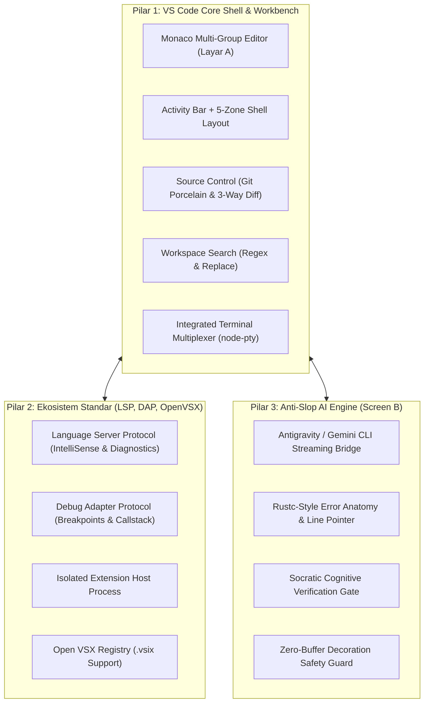

# BENCHMARK GOAL ROADMAP: NSCode (v0.1.1 -> v1.0.0)

> **"Make Coders Great Again. No Slop."** 🧢🚫

Dokumen ini mendefinisikan peta jalan benchmark arsitektural dan fungsional dari versi `0.1.1` menuju target paritas 100% Visual Studio Code pada versi `1.0.0`, dengan keunggulan diferensiasi sistem *Active-Cognition Anti-Slop (Screen B)*.

---

## 1. Arsitektur Target & Tiga Pilar Paritas

---

## 2. Granular Milestone Matrix (v0.1.1 hingga v1.0.0)

| Versi | Status Milestone | Fokus Utama & Paritas VS Code | Integrasi Anti-Slop / Gemini CLI | Opsi Dream-RSI Engine |
| :--- | :--- | :--- | :--- | :---: |
| **v0.1.1** | **SELESAI (100%)** | Git SCM, Search in Files, Open Folder, Auto-Clean Releases | Sidecar daemon ready, CLI process streaming dasar | *Nonaktif* |
| **v0.1.2** | **SELESAI (100%)** | File Explorer CRUD (context menu, rename, delete), Icon Theme | Path boundary guards, full Monaco tab sync | *Nonaktif* |
| **v0.2.0** | **SELESAI (100%)** | Screen B Guided Cognition, Target Stacking, Zero-Buffer Pointer | On-demand fast pattern scout, Technical Summary Cards | *Nonaktif* |
| **v0.3.0** | *Feature Release* | Language Server Protocol (LSP) Client (TS, Python, C++), Hover | Error diagnostics diarahkan ke Rustc-style visual | **Opsional (LSP AST Engine)** |
| **v0.4.0** | *Feature Release* | Terminal Multiplexing (multi-tabs, bash/powershell), `tasks.json` | Output terminal & log dapat di-pipe ke Screen B | **Opsional (Stream Tuning)** |
| **v0.5.0** | **BETA MILESTONE** | **Daily-Driver Ready**: Git complete, LSP complete, Lint/Format | **Socratic Cognitive Gate aktif penuh (Anti-Slop)** | *Selektif* |
| **v0.6.0** | *Feature Release* | Debug Adapter Protocol (DAP), Breakpoints, Watch, Variables | AI Debugging Explainer tanpa blind auto-patch | **Opsional (DAP State Machine)** |
| **v0.7.0** | *Feature Release* | Git 3-Way Merge Conflict Editor, Git Timeline & Graph | AI Conflict Resolution Analysis & Explanation | **Opsional (3-Way Merge Trees)** |
| **v0.8.0** | *Major Architecture* | Extension Host Process Isolation, Open VSX Catalog, `.vsix` | Ekstensi dapat mendaftarkan Cognitive Tools | **Opsional (API Reverse Eng)** |
| **v0.9.0** | *Release Candidate* | Testing Explorer (`Ctrl+Shift+T`), Multi-Root Workspaces | AI Automated Test Verification & Falsification | **Opsional (Test Discovery)** |
| **v1.0.0** | **GENERAL AVAILABILITY** | **100% VS Code Functional Parity** + Ekosistem Ekstensi | **Sovereign Anti-Slop IDE siap produksi global** | **Opsional (Full Parity Audit)** |

---

## 3. Rincian Teknis Tiap Milestone

### Milestone v0.1.1: Functional Workbench Core, SCM & Open Folder (Selesai)
- **Status Capaian:**
  - **Source Control (Git)**: Status detection, accordion Staged/Changes, Stage/Unstage/Discard, commit action, Monaco Side-by-Side Diff Editor.
  - **Search across Files**: Regex, case, whole word toggles, tree navigation ke baris kode.
  - **Open Folder & Explorer**: Full recursive directory walking, dynamic open/closed folder codicons, toolbar New File/Folder/Refresh actions, authentic empty workspace state.
  - **Release Pipeline & Storage**: Automated clean-up legacy releases (`predist` hook & `yarn clean:legacy`).
  - **Verification**: 302 / 302 tests passing (100%).

### Milestone v0.1.2: Explorer Operations, Context Menu & Icon Themes (Selesai 100%)
- **Status Capaian:**
  - **File Explorer Interaktif & Context Menu**:
    - Context Menu klik kanan pada file tree (New File, New Folder, Rename, Delete, Reveal in File Explorer, Copy Relative Path).
    - Shortcut keyboard di Explorer: `Delete` / `Backspace` (hapus dengan konfirmasi dialog), `F2` (inline rename).
    - Proteksi keamanan path IPC (`fs:createFile`, `fs:createDirectory`, `fs:rename`, `fs:delete`, `shell:revealInFolder`).
    - 10 skenario batas edge-cases adversarial teratasi (slash normalization, cache hygiene `expandedDirs`/`navHistory`, window blur dismissal).
  - **Modular Icon Theme System**:
    - Dukungan lengkap glif asli Codicon (`.codicon-python`, `.codicon-database`, `.codicon-json`, dll.).
    - Rotasi panah chevron folder dinamis dan warna emas folder autentik (`#dcb67a`).
  - **Verification**: 376 / 376 monorepo tests passing (100%), 60 unit tests di `v0_1_2_explorer_crud.test.ts`.
  - **Tab & Buffer State Management**:
    - Dirty document indicator (`●` lingkaran putih) pada tab saat buffer berubah.
    - Dialog konfirmasi *"Do you want to save the changes you made to..."* jika tab tertutup saat dirty.
    - Drag-and-drop tab untuk reordering antar editor group.
  - **Quick Open (`Ctrl+P`)**:
    - Fuzzy search instan di seluruh file workspace menggunakan in-memory trie/fuzzy matcher.
    - Pratinjau file dan riwayat berkas yang baru saja dibuka (*Recently Opened*).
  - **Status Bar Interaktif**:
    - Indikator baris & kolom (`Ln X, Col Y`).
    - Pilihan indentasi (Spaces vs Tabs, Tab Size 2/4).
    - Encoding picker (UTF-8) dan EOL picker (LF vs CRLF).

### Milestone v0.2.0: Gemini CLI Integration in Screen B (Milestone Kunci)
- **Target Paritas & Diferensiasi:**
  - **Bidirectional Context Synchronization**:
    - Layar A secara realtime mengirimkan: path berkas aktif, seleksi kode yang disorot, dan posisi kursor ke Layar B via Sidecar WebSocket.
    - Tombol cepat *"Ask Gemini about Selection"* (`Ctrl+Alt+A`).
  - **Unified Gemini / Antigravity CLI Streaming**:
    - Streaming output dari Gemini CLI menampilkan thinking process, reasoning steps, dan blok kode dengan syntax highlighting VS Code Dark+.
    - Status daemon monitor: status koneksi, kuota/model status, latency monitor.
  - **Rustc-Style Error Anatomy & Line Pointer**:
    - Error traceback diparsing menjadi visual pointer yang menandai baris presisi di Monaco Editor Layar A tanpa memodifikasi buffer teks (Zero-Buffer Decoration).
  - **Cognitive Verification Gate (Anti-Slop Invariant)**:
    - IDE menolak auto-patching buta. Sebelum kode disalin atau diterapkan, Layar B menampilkan kartu tantangan pemahaman (Socratic Questioning) untuk mencegah developer skill atrophy.

### Milestone v0.3.0: Language Server Protocol (LSP) & Code Intelligence
- **Target Paritas VS Code:**
  - **LSP Client Architecture**:
    - Integrasi `monaco-languageclient` dan `vscode-ws-jsonrpc` ke backend Electron.
    - Dukungan out-of-the-box untuk TypeScript/JavaScript (`typescript-language-server`), Python (`pyright` / `jedi`), dan C/C++ (`clangd`).
  - **Fitur IntelliSense Penuh**:
    - Autocomplete kontekstual dengan signature dan dokumentasi inline.
    - Parameter Hints saat mengetik argumen fungsi (`Ctrl+Shift+Space`).
    - Hover Tooltips: Tipe data, docstrings, dan markdown preview saat hover di atas simbol.
    - Go to Definition (`F12`), Peek Definition (`Alt+F12`), Find References (`Shift+F12`).
    - Rename Symbol (`F2`) yang mengupdate seluruh referensi di seluruh workspace secara atomik.
  - **Bottom Panel: Problems Tab**:
    - Mengagregasi seluruh error dan warning dari LSP server secara realtime dengan badge jumlah error (`#problems-badge`).
    - Klik item problem langsung memusatkan editor ke baris dan kolom yang bermasalah.

### Milestone v0.4.0: Terminal Multiplexing & Task Runner
- **Target Paritas VS Code:**
  - **Integrated Terminal Multiplexer**:
    - Dukungan multi-tab terminal di bottom panel (PowerShell, Command Prompt, Git Bash, WSL).
    - Pilihan shell default berdasarkan deteksi OS.
    - Split terminal (membuka dua sesi terminal berdampingan).
    - Status terminal: clear, kill, restart, nama custom tab, dan ikon status proses.
  - **Task Runner (`tasks.json`)**:
    - Mendukung konfigurasi format standar `.vscode/tasks.json`.
    - Menjalankan script npm, build command, test command, atau custom CLI.
    - Problem matchers untuk mem-parse output build langsung ke panel Problems.
  - **Output Channels**:
    - Dropdown channel log di tab Output: `Tasks`, `Git`, `AntiSlop Daemon`, `Language Server`.
  - **Keyboard Shortcuts Configuration (`keybindings.json`)**:
    - UI editor shortcut (`Ctrl+K Ctrl+S`) untuk mengubah binding tombol sesuai preferensi pengguna.

### Milestone v0.5.0: BETA MILESTONE (Full Daily Driver Workflow)
- **Kriteria Penerimaan (Acceptance Gate):**
  - **Kelayakan Daily-Driver**: Developer dapat membuka repositori riil (misal Next.js, Python FastAPI, Go, atau Rust), melakukan coding harian, formatting (Prettier), linting (ESLint), commit git, run/test di terminal terintegrasi, dan mencari teks di workspace tanpa perlu membuka aplikasi editor lain.
  - **Dual-Screen Stability**: Layar A dan Layar B bekerja harmonis tanpa lag, memory leak, atau IPC race conditions.
  - **Packaging Standalone**: Biner installer NSIS dan portable zip untuk Windows x64 dengan ukuran optimal dan waktu startup < 1.5 detik.
  - **Zero Regresi**: 100% lulus seluruh rangkaian test suite (>350 unit & integration tests).

### Milestone v0.6.0: Debug Adapter Protocol (DAP) Engine
- **Target Paritas VS Code:**
  - **DAP Client Core**:
    - Kompatibilitas dengan adapter debug standar (Node.js debug, Python `debugpy`, C++ `lldb`/`gdb`).
    - Konfigurasi debugging berbasis `.vscode/launch.json`.
  - **UI Debugging Komprehensif (`Ctrl+Shift+D`)**:
    - Panel Primary Sidebar: Variables (Local, Global, Closure), Watch expressions, Call Stack, Breakpoints.
    - Editor Gutter Breakpoints: Klik untuk pasang breakpoint lingkaran merah, hover preview.
    - Floating Debug Action Bar: Pause/Continue (`F5`), Step Over (`F10`), Step Into (`F11`), Step Out (`Shift+F11`), Restart (`Ctrl+Shift+F5`), Stop (`Shift+F5`).
    - Debug Console: Interactive REPL untuk evaluasi ekspresi saat breakpoint aktif.

### Milestone v0.7.0: Advanced Git & 3-Way Merge Conflict Editor
- **Target Paritas VS Code:**
  - **Operasi Git Tingkat Lanjut**:
    - Branch switcher & branch creator dari Status Bar (`git checkout -b`).
    - Fetch, Pull, Push dengan status remote tracking (`↑1 ↓2`).
    - Git Stash (Stash changes, Pop stash).
  - **3-Way Merge Conflict Editor**:
    - Deteksi berkas konflik merge.
    - Tombol inline CodeLens: *"Accept Current Change"*, *"Accept Incoming Change"*, *"Accept Both Changes"*, *"Compare Changes"*.
  - **Git Graph & Timeline View**:
    - Riwayat commit berkas lokal dari waktu ke waktu (*File Timeline*).

### Milestone v0.8.0: Extension Host & Open VSX Marketplace Integration
- **Target Paritas VS Code:**
  - **Proses Extension Host Terisolasi**:
    - Sub-proses Node.js independen yang menjalankan ekstensi.
    - Implementasi subset VS Code Extension API (`vscode.*`).
  - **Integrasi Open VSX Registry**:
    - Activity Bar Extensions View (`Ctrl+Shift+X`).
    - Pencarian, instalasi satu-klik, disable, dan uninstall ekstensi dari [Open VSX Registry](https://open-vsx.org/).
    - Dukungan instalasi offline melalui berkas package `.vsix`.

### Milestone v0.9.0: Testing Explorer & Multi-Root Workspaces
- **Target Paritas VS Code:**
  - **Test Explorer (`Ctrl+Shift+T`)**:
    - Auto-discovery unit tests (Vitest, Jest, Mocha, PyTest, Go test).
    - Status pohon pengujian: Pass, Fail, Running, Skipped.
  - **Multi-Root Workspaces**:
    - Membuka lebih dari satu folder root dalam satu jendela (`.code-workspace`).
  - **Zen Mode & Kustomisasi Tampilan**:
    - Fullscreen Zen Mode (`Ctrl+K Z`) menyembunyikan semua UI bar dan memfokuskan layar hanya pada editor.

### Milestone v1.0.0: GENERAL AVAILABILITY (100% Parity + Anti-Slop Sovereign)
- **Target Capaian Final:**
  - **Paritas Penuh 100% VS Code**: Seluruh fungsi esensial workbench, editor, SCM, debugging, terminal, ekstensi, dan konfigurasi VS Code telah terpasang dan berfungsi sempurna.
  - **Superioritas Cognitive Anti-Slop**: IDE bukan sekadar cloning, melainkan editor generasi baru yang memadukan kekuatan VS Code dengan pendamping AI aktif yang mempertahankan kecerdasan dan keterampilan sang developer.
  - **Zero-Crash Enterprise Reliability**: Lulus lebih dari 500 pengujian otomatis (unit, stress, adversarial, dan UI integration) dengan zero-memory leak.

---

## 4. Opsi Akselerasi Lanjutan: Dream-RSI Exploration Protocol (`/dream-rsi`)

Sesuai evaluasi arsitektural, **Dream-RSI (Recursive Self-Improvement via Replay World Models)** dicantumkan sebagai **Akselerator Eksplorasi Opsional** pada milestone teknis berat.

### Aturan Aktivasi Selektif
1. **Mode Default (Standar & Blitz-Swarm)**: Digunakan untuk 80% pekerjaan rutin (UI styling, keyboard shortcut, CRUD operasi file, integrasi menu). Cepat, efisien, dan hemat kuota tanpa overhead ledger.
2. **Eskalasi Opsional (`/dream-rsi`)**: Diaktifkan saat menghadapi:
   - **v0.2.0**: Tuning parameter streaming PTY node-pty & mitigasi backpressure terminal berkecepatan tinggi.
   - **v0.3.0**: Arsitektur `vscode-ws-jsonrpc` Language Server Protocol (LSP) multi-proses untuk menjaga alokasi memori buffer Monaco.
   - **v0.6.0**: Pemetaan state machine Debug Adapter Protocol (DAP) multi-thread.
   - **v0.8.0**: Reverse engineering API kompatibilitas ekstensi VS Code (`vscode.d.ts`).
   - **v1.0.0**: Matriks audit falsifikasi regresi menyeluruh (>500 unit tests).

Dengan konfigurasi ini, NSCode mendapatkan kecepatan implementasi maksimal pada task umum sekaligus daya jelajah komputasi tingkat tinggi saat menghadapi bottleneck teknis kompleks.
