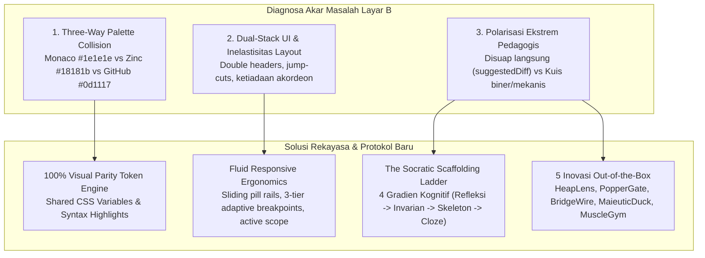
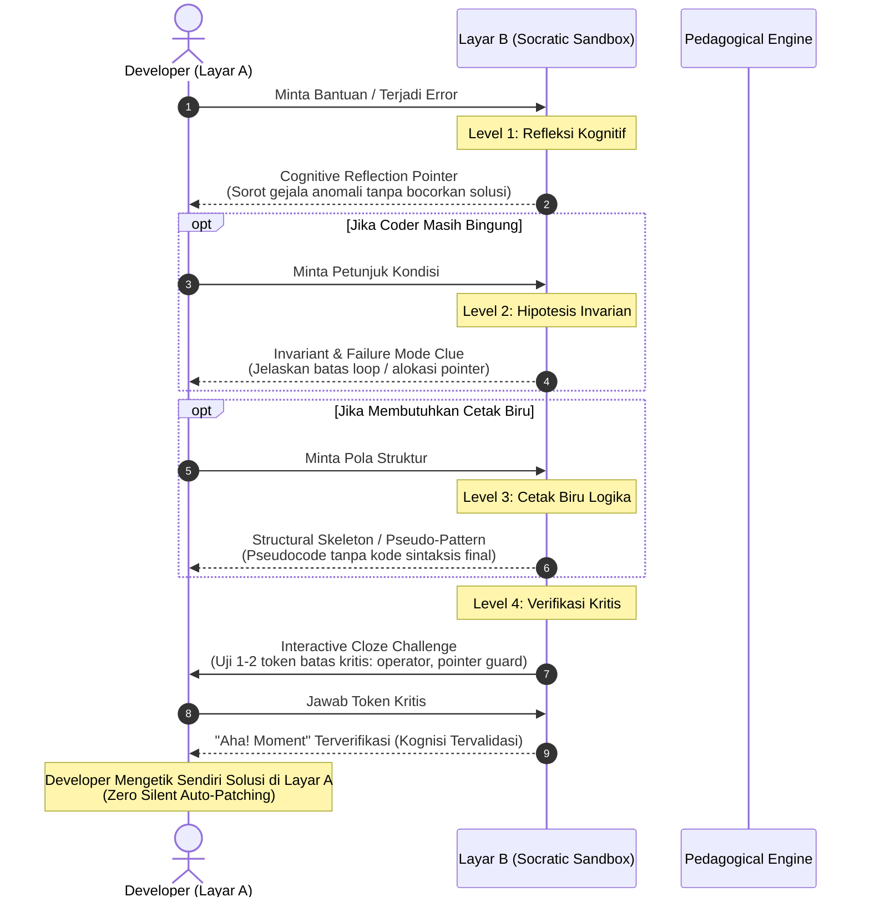

# EXECUTIVE DOSSIER: NSCode Screen B Dynamism, Visual Parity & Socratic Scaffolding

> **Status:** Deep Swarm Research Synthesis (Tier-1 Boost Reasoning x Blitz Map-Reduce)  
> **Target:** Layar B (Screen B Cognitive Sandbox) vs Layar A (Active Monaco Editor)  
> **Filosofi Inti:** *"Make Coders Great Again. No Slop."* — Active-Cognition Architecture

---

## 1. Arsitektur Masalah & Sintesis Diagnostik

Penyelidikan mendalam menemukan 3 akar masalah struktural yang membuat Layar B saat ini terasa kaku, tidak selaras secara estetika dengan Layar A, dan terjebak dalam dilema pedagogis:



---

## 2. Pilar 1: Theming & Color Parity (Keselarasan Layar A vs Layar B)

### Akar Masalah Visual
1. **Three-Way Ecosystem Palette Collision**: Layar A menggunakan tema VS Code Dark+ (`#1e1e1e` canvas, `#252526` sidebar, `#2d2d2d` border, `#d4d4d4` foreground). Namun Layar B shell menggunakan Tailwind Zinc (`#18181b`, `#27272a`, `#3f3f46`), dan webview React menginjeksi GitHub Dark (`#0d1117`, `#161b22`) serta Tailwind Slate (`#0f172a`). Ini menciptakan ketidakharmonisan warna yang mencolok.
2. **Iframe Isolation**: Variabel CSS yang didefinisikan di desktop `:root` tidak mengalir ke dalam `iframe#webview-frame`. Webview menggunakan private namespace yang terputus dari tema induk.
3. **Inverted Elevation**: Sidebar sekunder disetel ke `#18181b` (lebih gelap daripada editor `#1e1e1e`), dan kotak kode webview tenggelam ke hitam pekat (`#0d1117`), merusak hierarki kedalaman visual.
4. **Syntax Highlighting Deprivation**: Layar A memiliki pewarnaan sintaks semantik semarak, sedangkan kode di SmartCards Layar B dirender sebagai teks monokrom biasa tanpa token class.

### Matriks Solusi Token Bersama (Unified Tokens)
| Token Semantik | Layar A (Monaco Shell) | Layar B Eksisting (Clash) | Target Paritas Baru |
|---|---|---|---|
| **Canvas Background** | `#1e1e1e` | `#18181b` (Zinc-900) | `var(--vscode-sideBar-background, #252526)` |
| **Card Surface** | `#252526` | `#27272a` (Zinc-800) | `var(--vscode-card-background, #1e1e1e)` |
| **Code Box Surface** | `#1e1e1e` | `#0d1117` (GitHub Dark) | `var(--vscode-syntax-codeBackground, #1e1e1e)` |
| **Borders** | `#2d2d2d` | `#3f3f46` (Zinc-700) | `var(--vscode-sideBarSectionHeader-border, #2d2d2d)` |
| **Primary Text** | `#d4d4d4` | `#e4e4e7` / `#e6edf3` | `var(--vscode-editor-foreground, #d4d4d4)` |
| **Muted Text** | `#858585` | `#71717a` | `var(--vscode-descriptionForeground, #858585)` |
| **Syntax Keyword** | `#569cd6` | Monokrom | `var(--vscode-syntax-keyword, #569cd6)` |
| **Syntax String** | `#ce9178` | Monokrom | `var(--vscode-syntax-string, #ce9178)` |

---

## 3. Pilar 2: Kedinamisan & Ergonomi Layar B (Fluid Layout)

### Masalah Kekakuan (Stiffness Causes)
1. **Dual-Stack UI Hijacking**: `#screen-b-view-chat` menumpuk host thread, target stack, summary cards, dan iframe webview secara bersamaan, menghasilkan *double headers*, *double scrollbars*, dan hilangnya ruang vertikal.
2. **Abrupt Mode Jump-Cuts**: Pergantian mode Chat, Plan, dan Review dilakukan via `style.display = 'flex' / 'none'` seketika (0ms) tanpa kontinuitas visual.
3. **Inelastisitas Split Resizing**: Ketiadaan breakpoint responsif bertingkat membuat toolbar dan prompt bar bertabrakan saat split dipersempit ke 280px-340px.
4. **Ketiadaan Akordeon Progresif**: Target Line Stack memanjang ke bawah secara monolitik tanpa mekanisme collapsing menjadi compact chips.

### Solusi Desain Kinetik
1. **Fluid Sliding Pill Tab Rail**: Indikator aktif pada `.screen-b-mode-tabs` menggunakan rel transisi `transform: translateX()` (160ms, `cubic-bezier(0.16, 1, 0.3, 1)`) dengan cross-fade halus antar-panel.
2. **3-Tier Adaptive Breakpoints**:
   - `.screen-b-compact` (< 340px): Tab mode berubah menjadi ikon-only Codicon, breadcrumb diringkas, prompt dropdowns dikonsolidasi.
   - `.screen-b-standard` (340px - 520px): Tampilan proporsional standar teroptimasi.
   - `.screen-b-wide` (> 520px): Multi-pane dua kolom berdampingan (Target Stack di kiri, Dialog/Diff di kanan).
3. **Progressive Disclosure Stack Reel**: Target non-aktif otomatis mengerut menjadi chip horizontal 22px (`quicksort.py:15 [Active]` mengembang penuh), menjaga 75% ketinggian layar untuk percakapan kognitif.
4. **Live Active Scope Anchor**: Layar B mendengarkan `editor:cursorChange` untuk memperbarui badge fungsi/blok yang sedang diedit di Layar A secara real-time.
5. **Elastic Auto-Expanding Prompt Box**: Textarea input membesar dinamis (36px -> 160px) mengikuti ketikan developer, dan tombol submit bertransisi menjadi indikator morphing selama generasi AI.

---

## 4. Pilar 4: Protokol Pedagogis "The Socratic Scaffolding Ladder"

### Memecahkan Paradoks: Bukan Menyuap, Bukan Membiarkan Mandiri Buta
Saat ini terjadi polarisasi:
- *Disuap Langsung:* `suggestedDiff` dan `codeSnippet` langsung memperlihatkan kode perbaikan utuh siap copas.
- *Mandiri Buta:* Tantangan kuis biner mekanis (captcha choices atau mengetik ulang seluruh teks tanpa pemahaman konseptual).

### 4 Gradien Kognitif (The Scaffolding Ladder)



1. **Level 1 — Cognitive Reflection Pointer**: Mengarahkan tatapan developer ke baris atau span anomali melalui pertanyaan pemantik: *"Perhatikan nilai indeks pivot saat ukuran array berjumlah genap"*. Solusi sama sekali tidak dibocorkan.
2. **Level 2 — Invariant & Failure Mode Clue**: Menjelaskan konsep batas matematis atau arsitektur: *"Ketika rentang bernilai 1, truncating integer dapat menjebak loop dalam infinite recursion"*.
3. **Level 3 — Structural Skeleton / Pseudo-Pattern**: Memberikan pola struktur logika dalam bentuk pseudocode abstrak:
   ```text
   while [boundary_active]:
       mid = calculate_pivot()
       if [predicate_holds]: advance_left()
       else: contract_right()
   ```
4. **Level 4 — Interactive Verification / Cloze Challenge**: Menguji pemahaman melalui 1 token kunci (misal memilih operator `>=` vs `>` dengan rasional jika keliru). Begitu terjawab benar, developer mendapat keyakinan penuh untuk mengetikkan kodenya sendiri di Layar A.

---

## 5. Pilar 5: Lima Inovasi Out-of-the-Box (Breakthrough Features)

### 1. `HeapLens` — Interactive Memory & State Replay Simulator
- **Konsep:** Saat terjadi runtime bug level rendah (Segfault, Memory Leak, NullPointerException, Use-After-Free), Layar B merender diagram memori interaktif SVG (Stack frames, Heap blocks, Pointer arrows) dilengkapi time-scrubber 5 langkah.
- **Diferensiasi:** Alih-alih membaca pesan error statis, developer menggeser slider waktu untuk melihat mutasi alokasi memori dan memilih pointer mana yang kehilangan kepemilikan sebelum kunci dibuka.

### 2. `PopperGate` — Counterfactual Stress-Tester & "What-If" Falsifier
- **Konsep:** Didasarkan pada prinsip falsifikasi Karl Popper. Sebelum kode dikompilasi atau dijalankan, Layar B secara otomatis memunculkan 3 kasus uji ekstrem (edge inputs: array kosong, bilangan negatif, nilai maksimum integer).
- **Diferensiasi:** Developer ditantang memprediksi: *"Jika fungsi baris 24 menerima array kosong, apakah fungsi mengembalikan empty, throw exception, atau loop tak berujung?"*. Setelah ditebak, runner mengeksekusi micro-sandbox dan menyajikan skor akurasi kognitif developer.

### 3. `BridgeWire` — Live Rustc-Style AST Telemetry Connector
- **Konsep:** Garis lengkung visual kinetik SVG (spline bezier) berpendar yang melintasi sash pembatas antara Layar A dan Layar B.
- **Diferensiasi:** Garis ini menghubungkan token error di Layar A langsung ke kartu penjelasan di Layar B, dan terus melacak posisi baris secara mulus (60fps) saat Monaco editor di-scroll, menjaga kontinuitas tatapan (*gaze continuity*) dan memori spasial developer.

### 4. `MaieuticDuck` — Socratic Rubber Duck Mode (Dialectic Debugger)
- **Konsep:** Mode dialog interaktif murni berbasis teknik Maieutika Sokrates di mana AI **dilarang keras** memberikan kode solusi, melainkan hanya bertanya balik untuk memandu developer:
  1. *Elicit Invariant:* "Apa ekspektasi Anda pada baris 42?"
  2. *Probe Discrepancy:* "Jika kondisi edge-case X terjadi, apakah baris ini memenuhinya?"
  3. *Validate Fix:* "Bagaimana Anda akan membatasi kondisi tersebut?"
- **Diferensiasi:** Meningkatkan retensi pemahaman developer dari ~15% (pasif membaca jawaban AI) menjadi >80% (menemukan sendiri).

### 5. `MuscleGym` — Code Muscle Gym & Zero-Boilerplate Syntax Drills
- **Konsep:** Micro-drills 60 detik berbasis kode aktif untuk melatih memori motorik penulisan algoritma tanpa ketergantungan autocomplete.
- **Diferensiasi:** Jika developer sering salah sintaksis pada konsep tertentu (misal smart pointer C++, pattern matching Rust, atau async concurrency), Layar B menyajikan sesi latihan mengetik mini anti-paste dengan spaced repetition (SRS) untuk mempertajam kelancaran mengetik di lingkungan tanpa AI.
