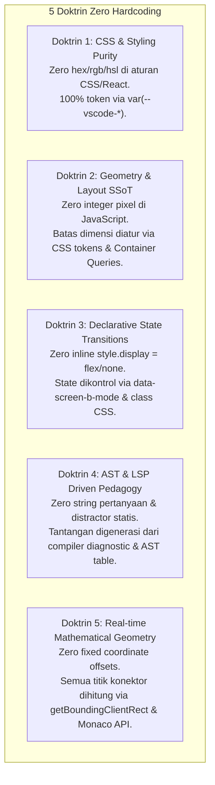
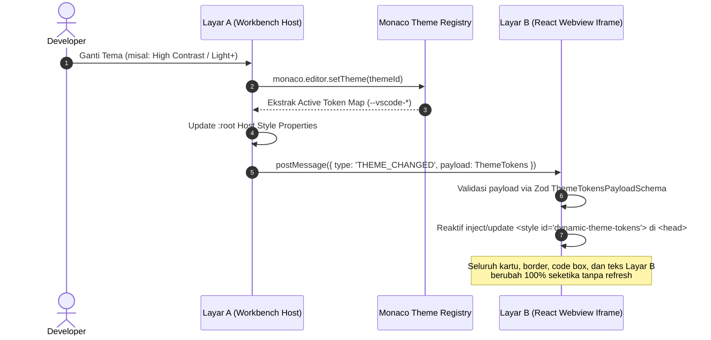
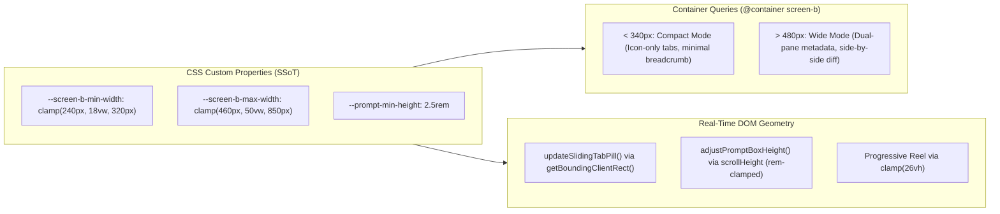
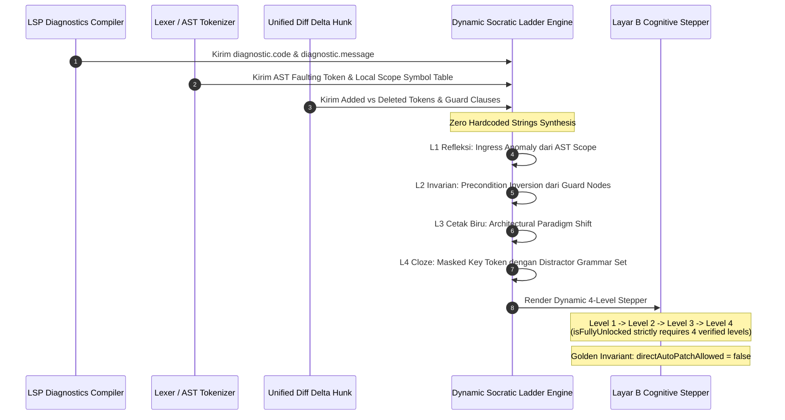

# ROADMAP STRATEGIS: PENGEMBANGAN LAYAR B BERTAHAP (ZERO-HARDCODE INVARIANT)

> **Status:** Deep Swarm Architectural Synthesis (Tier-1 Boost Reasoning x Blitz Map-Reduce)  
> **Target:** Transformasi Layar B NSCode (Kepatuhan Visual, Kedinamisan Kinetik, Protokol Sokratik, & Inovasi Out-of-the-Box)  
> **Konstitusi Mutlak:** **RULE ZERO HARDCODING** — Tidak ada satu pun kode warna heksadesimal statis, magic number pixel, string pertanyaan statis, distractor fiktif, atau offset geometri hardcoded.

---

## 1. Konstitusi "Zero Hardcoding" (Arsitektur Invarian Mutlak)

Setiap baris kode baru yang ditulis untuk Layar B wajib mematuhi 5 Doktrin Ketiadaan Hardcode:

---

## 2. Tahap 1: Dynamic Zero-Hardcode Theming & Iframe Token Bridge

### Tujuan & Ruang Lingkup
Menyelaraskan pewarnaan Layar B secara mutlak dengan Layar A (Monaco Editor & VS Code Dark+ shell). Menjamin bahwa ketika tema Monaco diubah (`vs-dark`, `vs` Light+, `hc-black` High Contrast, atau `monokai`), Layar B otomatis 100% mengikuti secara dinamis tanpa restart dan tanpa kode warna hardcoded.

### Aturan Khusus Zero-Hardcode (Tahap 1)
1. **Zero Hex in CSS**: Dilarang menggunakan `#18181b`, `#27272a`, `#0d1117`, `#007acc`, atau warna heksadesimal lainnya pada selektor CSS di [`workbench.css`](file:///C:/laragon/www/_Projek/NSCode/packages/antislop-desktop/src/workbench/workbench.css) maupun [`index.css`](file:///C:/laragon/www/_Projek/NSCode/packages/antislop-webview/src/index.css). Semua warna wajib merujuk ke `var(--vscode-*)`.
2. **Zero Inline Styles in React**: Komponen React ([`App.tsx`](file:///C:/laragon/www/_Projek/NSCode/packages/antislop-webview/src/App.tsx), [`ContractViolated.tsx`](file:///C:/laragon/www/_Projek/NSCode/packages/antislop-webview/src/components/TopZone/ContractViolated.tsx)) dilarang menyematkan atribut `style={{ background: '#252526', color: '#cccccc' }}`.
3. **Protocol-Driven Token Handshake**: Protokol pesan IPC wajib didefinisikan secara formal di [`@antislop/protocol`](file:///C:/laragon/www/_Projek/NSCode/packages/antislop-protocol) menggunakan skema Zod `ThemeTokensPayloadSchema`.

### Langkah Eksekusi Tahap 1
- **Langkah 1.1**: Tambahkan `ThemeTokensPayloadSchema` dan tipe pesan `THEME_CHANGED` di [`packages/antislop-protocol/src/webview-messages.ts`](file:///C:/laragon/www/_Projek/NSCode/packages/antislop-protocol/src/webview-messages.ts).
- **Langkah 1.2**: Implementasikan `ThemeRegistry` di workbench desktop yang mendefinisikan pemetaan token resmi VS Code Dark+, Light+, HC-Black, dan Monokai.
- **Langkah 1.3**: Refaktor [`workbench.css`](file:///C:/laragon/www/_Projek/NSCode/packages/antislop-desktop/src/workbench/workbench.css) dan [`packages/antislop-webview/src/index.css`](file:///C:/laragon/www/_Projek/NSCode/packages/antislop-webview/src/index.css) untuk membersihkan seluruh nilai heksadesimal statis dan menggantinya dengan variabel CSS semantik.
- **Langkah 1.4**: Pasang listener `THEME_CHANGED` di [`packages/antislop-webview/src/vscode-api.ts`](file:///C:/laragon/www/_Projek/NSCode/packages/antislop-webview/src/vscode-api.ts) yang menyuntikkan `<style id="dynamic-theme-tokens">` ke `<head>` webview.
- **Langkah 1.5**: Bersihkan seluruh inline styles hardcoded di komponen React Layar B.

---

## 3. Tahap 2: Dynamic Zero-Hardcode Layout & Fluid Ergonomics

### Tujuan & Ruang Lingkup
Menghilangkan seluruh kekakuan antarmuka pada Layar B: mengganti `style.display = 'flex'/'none'` yang kaku dengan state deklaratif, mengganti magic numbers pixel resizer dengan Single Source of Truth (SSoT) CSS Custom Properties, menghadirkan rel *sliding pill* animasi pada tab switcher, dan menerapkan *elastic auto-growing textarea*.

### Aturan Khusus Zero-Hardcode (Tahap 2)
1. **Zero Magic Numbers in JS**: Dilarang keras menyimpan angka integer pixel statis (seperti `160`, `280`, `600`, `700`) di dalam fungsi JavaScript. Batas dimensi wajib dibaca secara dinamis dari `getComputedStyle()`.
2. **Declarative State Switching**: Dilarang memanipulasi `el.style.display` secara langsung di JS. Visibilitas tab dan panel wajib dikendalikan oleh atribut state HTML: `[data-screen-b-mode="chat" | "plan" | "review"]`.
3. **Container Query First**: Responsivitas komponen internal Layar B wajib dikendalikan oleh lebar container-nya sendiri (`@container screen-b (max-width: ...)`), bukan oleh `@media` query jendela global.
4. **DOM-Measured Sliding Pill**: Posisi dan lebar rel pill tab switcher wajib dihitung secara dinamis dari `tabRect.left - containerRect.left` dan `tabRect.width` aktual, bukan dari tabel translasi statis.

### Langkah Eksekusi Tahap 2
- **Langkah 2.1**: Deklarasikan `container-name: screen-b; container-type: inline-size;` pada `.zone-secondary-sidebar` di [`workbench.css`](file:///C:/laragon/www/_Projek/NSCode/packages/antislop-desktop/src/workbench/workbench.css).
- **Langkah 2.2**: Tambahkan elemen `#screen-b-tab-pill` di dalam `#screen-b-mode-tabs` di [`index.html`](file:///C:/laragon/www/_Projek/NSCode/packages/antislop-desktop/src/workbench/index.html) dan atur rel transisi kinetik dengan kurva `cubic-bezier(0.16, 1, 0.3, 1)`.
- **Langkah 2.3**: Implementasikan `updateSlidingTabPill()` di [`workbench.js`](file:///C:/laragon/www/_Projek/NSCode/packages/antislop-desktop/src/workbench/workbench.js) yang terhubung dengan `ResizeObserver`.
- **Langkah 2.4**: Ubah `setScreenBMode(mode)` untuk memutasi atribut deklaratif `secondarySidebar.setAttribute('data-screen-b-mode', mode)` dan hapus semua manipulasi `style.display = 'flex'/'none'`.
- **Langkah 2.5**: Pasang fungsi `adjustPromptBoxHeight()` elastis pada `#prompt-input-box` berbasis `scrollHeight` dengan batas `clamp` relatif (`rem`).
- **Langkah 2.6**: Refaktor `SidebarResizer` untuk membaca batas dimensi dinamis dari computed style CSS tokens.

---

## 4. Tahap 3: Zero-Hardcode Socratic Scaffolding Protocol

### Tujuan & Ruang Lingkup
Mengeliminasi pertanyaan pilihan ganda statis, distractor lelucon/AI-slop, dan substring matching primitif di `generateSocraticChallenge`. Menggantikannya dengan **Dynamic Socratic Challenge Engine** yang menyusun 4 tangga bimbingan kognitif secara dinamis langsung dari LSP Diagnostics compiler aktif, tabel simbol AST, dan delta diff hunk.

### Aturan Khusus Zero-Hardcode (Tahap 3)
1. **Zero Static Question Strings**: Dilarang meng-hardcode string pertanyaan naratif (seperti `"Why does the proposed change in ... introduce boundary validation?"`). Pertanyaan wajib dirangkai dari parameter variabel formal AST dan diagnosa compiler.
2. **Zero Fictional / Slop Distractors**: Dilarang menyematkan distractor lelucon atau fiktif (seperti `"bypassing V8 GC"` atau `"reboot operating system"`). Pilihan pengecoh wajib diambil secara eksklusif dari *AST Local Symbol Table* atau himpunan resmi *Grammar Token Lexicon* bahasa target.
3. **Zero Substring Category Dispatch**: Dilarang mendeteksi kategori tantangan via `proposed.includes('await')` atau `description.includes('async')`. Kategori wajib berasal dari kode diagnosa LSP resmi dan tipe sintaksis AST node.
4. **Golden Invariant Enforcement**: Sesi verifikasi kognitif (`isFullyUnlocked`) hanya bernilai `true` jika dan hanya jika ke-4 level scaffolding berhasil diselesaikan secara berurutan. Tombol direct auto-patch ke disk tetap dilarang mutlak (`directAutoPatchAllowed: false`).

### Langkah Eksekusi Tahap 3
- **Langkah 3.1**: Buat modul skema Zod [`packages/antislop-protocol/src/socratic-ladder.ts`](file:///C:/laragon/www/_Projek/NSCode/packages/antislop-protocol/src/socratic-ladder.ts) yang mendefinisikan `SocraticLadderLevelSchema`, `SocraticLadderSessionSchema`, dan transisi event murni.
- **Langkah 3.2**: Bangun `SocraticLadderEngine` di sidecar yang mengekstrak data dari LSP Diagnostics, Lexer AST per bahasa target, dan Git Diff Hunk, serta menyusun tantangan dinamis tanpa string statis.
- **Langkah 3.3**: Tambahkan metode JSON-RPC baca-saja `diagnostics.generateSocraticLadder` dan `diagnostics.answerSocraticLevel` pada router sidecar.
- **Langkah 3.4**: Hapus fungsi `generateSocraticChallenge` statis di [`workbench.js`](file:///C:/laragon/www/_Projek/NSCode/packages/antislop-desktop/src/workbench/workbench.js) (baris 5556–5765) dan hubungkan antarmuka dengan `SocraticLadderEngine`.
- **Langkah 3.5**: Rancang komponen visual Stepper 4 Level di Layar B dengan verifikasi kognitif bertahap sebelum kode dapat diaplikasikan mandiri di Layar A.

---

## 5. Tahap 4: Zero-Hardcode Radical Innovations (BridgeWire, PopperGate, MaieuticDuck)

### Tujuan & Ruang Lingkup
Mengimplementasikan 3 inovasi *out-of-the-box* berdaya saing tinggi yang tidak dimiliki oleh Cursor maupun Copilot, dengan kalkulasi geometri matematis 100% dinamis dan generator falsifikasi berbasis tipe tanpa data dummy.

```mermaid
graph TD
    subgraph BridgeWireModule ["BridgeWire: Live Kinetic Spline Connector"]
        BW1["Monaco getScrolledVisiblePosition({lineNumber})"] --> BW3["Dynamic Start (x1, y1)"]
        BW2["targetCard.getBoundingClientRect()"] --> BW4["Dynamic End (x2, y2)"]
        BW3 & BW4 --> BW5["Euclidean Distance Math & Bézier Spline d='M C'"]
        BW5 --> BW6["RAF Dirty-Flagged Render Loop (60fps Scroll Tracking)"]
    end

    subgraph PopperGateModule ["PopperGate: Counterfactual Stress-Tester"]
        PG1["AST Function Parameter & Type Extraction"] --> PG2["Type-Driven Extreme Value Domains (0, -1, '', [], null)"]
        PG2 --> PG3["Cartesian Product Generator (Top-16 Boundary Permutations)"]
        PG3 --> PG4["Micro-Sandbox Falsification Evaluator (Pass/Fail Gate)"]
    end

    subgraph MaieuticDuckModule ["MaieuticDuck: Socratic Dialectic Debugger"]
        MD1["In-Flight AST Context Envelope Builder"] --> MD2["Dialectic State Machine (Probe -> Invariant -> Synthesis)"]
        MD2 --> MD3["Zero-Solution Socratic Dialogue Enforcer"]
    end
```

### Aturan Khusus Zero-Hardcode (Tahap 4)
1. **Zero Fixed Pixel Coordinate Offsets**: Semua titik ujung konektor `BridgeWire` `(x1, y1)` dan `(x2, y2)` wajib dihitung secara dinamis via `getBoundingClientRect()` dan Monaco layout API. Dilarang keras menyematkan konstanta magic number seperti `+240px` atau `-48px`.
2. **Zero Magic Spline Tension**: Titik kontrol Bézier `(cx1, cy1, cx2, cy2)` wajib diturunkan secara matematis dari jarak Euclidean `dx = x2 - x1` dan `dy = y2 - y1`.
3. **Zero Static Test Fixtures**: `PopperGate` dilarang menggunakan data uji hardcoded. Vektor input batas wajib disintesis secara dinamis berdasarkan tipe parameter fungsi yang dideklarasikan atau diinferensikan dari AST.
4. **Zero Scripted Socratic Prompts**: `MaieuticDuck` dilarang menggunakan script dialog kaku; nama fungsi aktual, baris kesalahan, dan jenis error wajib diinjeksikan secara *in-flight* ke dalam prompt envelope runtime.

### Langkah Eksekusi Tahap 4
- **Langkah 4.1**: Tambahkan layer `#bridgewire-overlay-canvas` (SVG fixed viewport overlay) di [`index.html`](file:///C:/laragon/www/_Projek/NSCode/packages/antislop-desktop/src/workbench/index.html) dengan filter glow dan animasi dash pulse kinetik.
- **Langkah 4.2**: Bangun kelas `BridgeWireController` di [`workbench.js`](file:///C:/laragon/www/_Projek/NSCode/packages/antislop-desktop/src/workbench/workbench.js) yang mengeksekusi kalkulasi spline kubik pada loop `requestAnimationFrame` dan sinkron dengan `editor.onDidScrollChange`.
- **Langkah 4.3**: Bangun `PopperGateEngine` yang mengekstrak tipe parameter fungsi aktif dan menyintesis 16 vektor input batas untuk menguji ketahanan kode sebelum kompilasi.
- **Langkah 4.4**: Implementasikan mode tab `MaieuticDuck` di header Layar B dengan pembungkus envelope runtime yang menegakkan kebijakan pantang solusi langsung (*zero-solution dialectic*).
- **Langkah 4.5**: Susun test suite otomatis untuk memvalidasi presisi koordinat spline di bawah beragam ukuran split screen dan perubahan tema.
